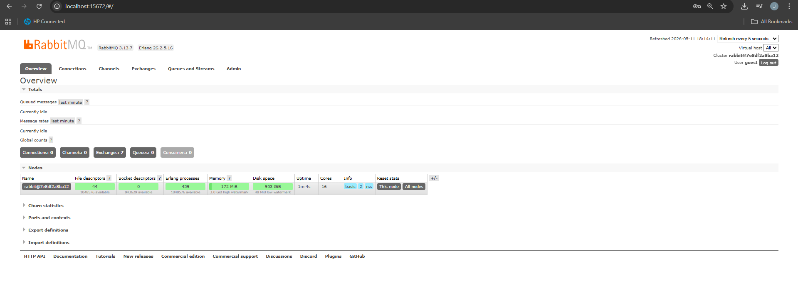
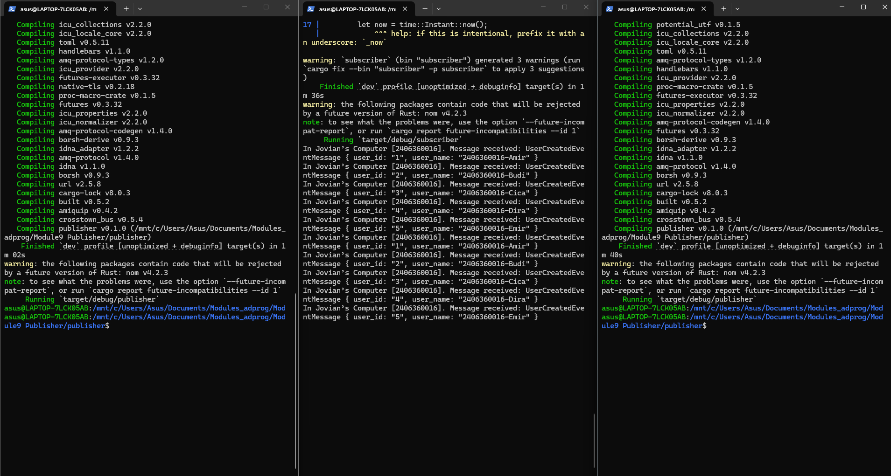

Publisher Reflection : 
1. Seperti yang terlihat di main program, publisher akan mengirim 5 message ke message broker (RabbitMQ) dalam sekali jalan. Program akan memanggil p.publish_event method 5 kali berurutan sehingga mengirim UserCreatedEventMessage ke 5 user berbeda yaitu Amir, Budi, Cica, Dira, dan Emir.

2. Publisher dan subscriber terhubung ke message broker yang sama yaitu RabbitMQ server karena mereka memiliki url yang sama. Mereka menggunakan lokasi yang sama yaitu localhost dan port yang sama yaitu 5672. Lalu, mereka juga menggunakan credentials yang sama yaitu di guest. Shared connection ini perlu sehingga subscriber bisa mendengar dan menerima pesan yang dikirim publisher ke broker.

Screenshot RabbitMQ : 

Screenshot terminal run :

Explanation : 
- Ketika perintah cargo run dijalankan pada subscriber, maka sisi subscriber akan mencoba membuka koneksi ke RabbitMQ server menggunakan URL yang sudah diset dalam kode. Jika koneksi berhasil, aplikasi akan membuat sebuah channel komunikasi. Kita juga bisa lihat pada rabbitMQ dashboard untuk jumlah connections dan channels minimal bertambah menjadi 1.
- Program akan mendaftarkan sebuah queue dan mulai mendengarkan secara terus menerus terhadap pesan yang masuk. Ketika publisher belum dijalankan, terminal subscriber akan terlihat diam karena dia sedang berada dalam kondisi waiting mode (menunggu pesan dari broker).
- Ketika perintah cargo run dijalankan pada publisher, maka sisi publisher akan mengirim 5 data ke subscriber. Subscriber siap memproses data apapun yang dikirim oleh Publisher.